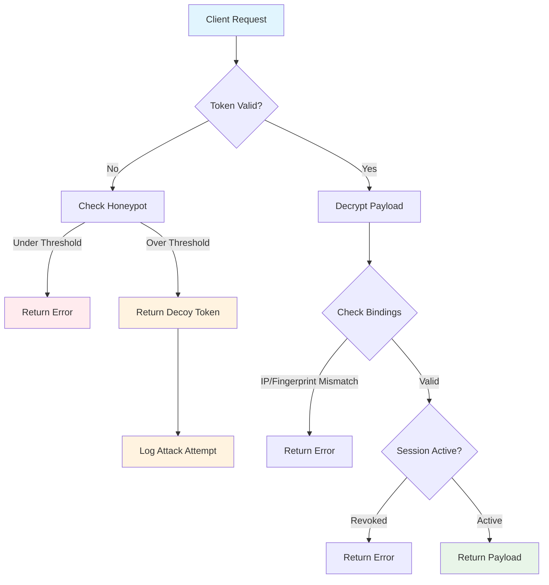

# Secure Token Toolkit

A robust Node.js library for creating and managing secure JWT-like tokens with built-in security features including honeypot protection, session management, and advanced binding options.

## Features

- **AES-256-GCM Encryption**: All token payloads are encrypted with industry-standard encryption
- **HMAC-SHA512 Signing**: Cryptographic signatures prevent token tampering
- **Honeypot Protection**: Built-in protection against brute force attacks with decoy tokens
- **Session Management**: Optional session storage and revocation capabilities
- **IP & Fingerprint Binding**: Bind tokens to specific IP addresses or browser fingerprints
- **Refresh Token Support**: Secure token refresh mechanism
- **Timing Attack Protection**: Uses timing-safe comparison for signature verification

## Installation

```bash
npm install @compyai/securetoken
```

## Quick Start

```javascript
const { createSecureTokenToolkit } = require("@compyai/securetoken");

// Initialize the toolkit with encryption keys
const toolkit = createSecureTokenToolkit({
  encKey: "your-256-bit-encryption-key-in-hex", // 64 hex characters
  hmacKey: "your-256-bit-hmac-key-in-hex", // 64 hex characters
});

// Create a token
const { accessToken, refreshToken } = await toolkit.createToken(
  { userId: 123, role: "user" },
  { expiresIn: 900, refresh: true }
);

// Verify a token
try {
  const payload = await toolkit.verifyToken(accessToken);
  console.log("User ID:", payload.userId);
} catch (error) {
  console.error("Token verification failed:", error.message);
}
```

## How It Works



## Configuration

### Basic Configuration

```javascript
const config = {
  encKey: "your-256-bit-encryption-key-in-hex",
  hmacKey: "your-256-bit-hmac-key-in-hex",
};
```

### Advanced Configuration with Honeypot

```javascript
const config = {
  encKey: "your-256-bit-encryption-key-in-hex",
  hmacKey: "your-256-bit-hmac-key-in-hex",
  honeypot: {
    enabled: true,
    failThreshold: 5,
    decoyPayload: { userId: 999, role: "admin" },
    slowResponses: true,
    onTriggered: (failInfo) => {
      console.log("Honeypot triggered:", failInfo);
    },
    onDecoyUse: (payload) => {
      console.log("Decoy token used:", payload);
    },
  },
  store: {
    saveSession: async (sessionId, data) => {
      // Save session to your database
    },
    saveRefresh: async (sessionId, data) => {
      // Save refresh token info to your database
    },
    isSessionRevoked: async (sessionId) => {
      // Check if session is revoked
      return false;
    },
    isRefreshRevoked: async (sessionId) => {
      // Check if refresh token is revoked
      return false;
    },
    revokeRefresh: async (sessionId) => {
      // Revoke refresh token
    },
  },
};
```

## Session Store Backends

The toolkit supports various session storage backends. Here are complete implementation examples:

### Redis Store (Recommended for Production)

```javascript
const Redis = require("ioredis");
const { createSecureTokenToolkit } = require("@compyai/securetoken");

const redis = new Redis({
  host: "localhost",
  port: 6379,
  retryDelayOnFailover: 100,
  maxRetriesPerRequest: 3,
});

const redisStore = {
  async saveSession(sessionId, data) {
    const key = `session:${sessionId}`;
    await redis.setex(
      key,
      data.exp - Math.floor(Date.now() / 1000),
      JSON.stringify(data)
    );
  },

  async saveRefresh(sessionId, data) {
    const key = `refresh:${sessionId}`;
    await redis.setex(
      key,
      data.exp - Math.floor(Date.now() / 1000),
      JSON.stringify(data)
    );
  },

  async isSessionRevoked(sessionId) {
    const key = `session:${sessionId}`;
    const result = await redis.get(key);
    return result === null;
  },

  async isRefreshRevoked(sessionId) {
    const key = `refresh:${sessionId}`;
    const result = await redis.get(key);
    return result === null;
  },

  async revokeRefresh(sessionId) {
    const key = `refresh:${sessionId}`;
    await redis.del(key);
  },

  async revokeSession(sessionId) {
    const sessionKey = `session:${sessionId}`;
    const refreshKey = `refresh:${sessionId}`;
    await redis.del([sessionKey, refreshKey]);
  },
};

const toolkit = createSecureTokenToolkit({
  encKey: process.env.TOKEN_ENC_KEY,
  hmacKey: process.env.TOKEN_HMAC_KEY,
  store: redisStore,
});
```

### Database Store (PostgreSQL Example)

```javascript
const { Pool } = require("pg");
const { createSecureTokenToolkit } = require("@compyai/securetoken");

const pool = new Pool({
  user: "username",
  host: "localhost",
  database: "myapp",
  password: "password",
  port: 5432,
});

// Database schema:
// CREATE TABLE sessions (
//   session_id UUID PRIMARY KEY,
//   data JSONB NOT NULL,
//   expires_at TIMESTAMP NOT NULL,
//   created_at TIMESTAMP DEFAULT NOW()
// );
//
// CREATE TABLE refresh_tokens (
//   session_id UUID PRIMARY KEY,
//   data JSONB NOT NULL,
//   expires_at TIMESTAMP NOT NULL,
//   created_at TIMESTAMP DEFAULT NOW()
// );

const dbStore = {
  async saveSession(sessionId, data) {
    const expiresAt = new Date(data.exp * 1000);
    await pool.query(
      "INSERT INTO sessions (session_id, data, expires_at) VALUES ($1, $2, $3) ON CONFLICT (session_id) DO UPDATE SET data = $2, expires_at = $3",
      [sessionId, JSON.stringify(data), expiresAt]
    );
  },

  async saveRefresh(sessionId, data) {
    const expiresAt = new Date(data.exp * 1000);
    await pool.query(
      "INSERT INTO refresh_tokens (session_id, data, expires_at) VALUES ($1, $2, $3) ON CONFLICT (session_id) DO UPDATE SET data = $2, expires_at = $3",
      [sessionId, JSON.stringify(data), expiresAt]
    );
  },

  async isSessionRevoked(sessionId) {
    const result = await pool.query(
      "SELECT 1 FROM sessions WHERE session_id = $1 AND expires_at > NOW()",
      [sessionId]
    );
    return result.rows.length === 0;
  },

  async isRefreshRevoked(sessionId) {
    const result = await pool.query(
      "SELECT 1 FROM refresh_tokens WHERE session_id = $1 AND expires_at > NOW()",
      [sessionId]
    );
    return result.rows.length === 0;
  },

  async revokeRefresh(sessionId) {
    await pool.query("DELETE FROM refresh_tokens WHERE session_id = $1", [
      sessionId,
    ]);
  },

  async revokeSession(sessionId) {
    const client = await pool.connect();
    try {
      await client.query("BEGIN");
      await client.query("DELETE FROM sessions WHERE session_id = $1", [
        sessionId,
      ]);
      await client.query("DELETE FROM refresh_tokens WHERE session_id = $1", [
        sessionId,
      ]);
      await client.query("COMMIT");
    } catch (error) {
      await client.query("ROLLBACK");
      throw error;
    } finally {
      client.release();
    }
  },
};

const toolkit = createSecureTokenToolkit({
  encKey: process.env.TOKEN_ENC_KEY,
  hmacKey: process.env.TOKEN_HMAC_KEY,
  store: dbStore,
});
```

### In-Memory Store (Development/Testing)

```javascript
const { createSecureTokenToolkit } = require("@compyai/securetoken");

class MemoryStore {
  constructor() {
    this.sessions = new Map();
    this.refreshTokens = new Map();
    this.cleanup();
  }

  async saveSession(sessionId, data) {
    this.sessions.set(sessionId, {
      data,
      expiresAt: data.exp * 1000,
    });
  }

  async saveRefresh(sessionId, data) {
    this.refreshTokens.set(sessionId, {
      data,
      expiresAt: data.exp * 1000,
    });
  }

  async isSessionRevoked(sessionId) {
    const session = this.sessions.get(sessionId);
    if (!session) return true;
    if (Date.now() > session.expiresAt) {
      this.sessions.delete(sessionId);
      return true;
    }
    return false;
  }

  async isRefreshRevoked(sessionId) {
    const refresh = this.refreshTokens.get(sessionId);
    if (!refresh) return true;
    if (Date.now() > refresh.expiresAt) {
      this.refreshTokens.delete(sessionId);
      return true;
    }
    return false;
  }

  async revokeRefresh(sessionId) {
    this.refreshTokens.delete(sessionId);
  }

  async revokeSession(sessionId) {
    this.sessions.delete(sessionId);
    this.refreshTokens.delete(sessionId);
  }

  // Cleanup expired entries every 5 minutes
  cleanup() {
    setInterval(() => {
      const now = Date.now();

      for (const [sessionId, session] of this.sessions.entries()) {
        if (now > session.expiresAt) {
          this.sessions.delete(sessionId);
        }
      }

      for (const [sessionId, refresh] of this.refreshTokens.entries()) {
        if (now > refresh.expiresAt) {
          this.refreshTokens.delete(sessionId);
        }
      }
    }, 5 * 60 * 1000);
  }
}

const memoryStore = new MemoryStore();

const toolkit = createSecureTokenToolkit({
  encKey: process.env.TOKEN_ENC_KEY,
  hmacKey: process.env.TOKEN_HMAC_KEY,
  store: memoryStore,
});
```

### MongoDB Store

```javascript
const { MongoClient } = require("mongodb");
const { createSecureTokenToolkit } = require("@compyai/securetoken");

const client = new MongoClient("mongodb://localhost:27017");
const db = client.db("myapp");

// Create indexes for automatic expiration
// db.sessions.createIndex({ "expiresAt": 1 }, { expireAfterSeconds: 0 });
// db.refreshTokens.createIndex({ "expiresAt": 1 }, { expireAfterSeconds: 0 });

const mongoStore = {
  async saveSession(sessionId, data) {
    await db.collection("sessions").replaceOne(
      { sessionId },
      {
        sessionId,
        data,
        expiresAt: new Date(data.exp * 1000),
        createdAt: new Date(),
      },
      { upsert: true }
    );
  },

  async saveRefresh(sessionId, data) {
    await db.collection("refreshTokens").replaceOne(
      { sessionId },
      {
        sessionId,
        data,
        expiresAt: new Date(data.exp * 1000),
        createdAt: new Date(),
      },
      { upsert: true }
    );
  },

  async isSessionRevoked(sessionId) {
    const session = await db.collection("sessions").findOne({
      sessionId,
      expiresAt: { $gt: new Date() },
    });
    return !session;
  },

  async isRefreshRevoked(sessionId) {
    const refresh = await db.collection("refreshTokens").findOne({
      sessionId,
      expiresAt: { $gt: new Date() },
    });
    return !refresh;
  },

  async revokeRefresh(sessionId) {
    await db.collection("refreshTokens").deleteOne({ sessionId });
  },

  async revokeSession(sessionId) {
    await Promise.all([
      db.collection("sessions").deleteOne({ sessionId }),
      db.collection("refreshTokens").deleteOne({ sessionId }),
    ]);
  },
};

const toolkit = createSecureTokenToolkit({
  encKey: process.env.TOKEN_ENC_KEY,
  hmacKey: process.env.TOKEN_HMAC_KEY,
  store: mongoStore,
});
```

## API Reference

### createToken(payload, options)

Creates a new encrypted and signed token.

**Parameters:**

- `payload` (Object): The data to include in the token
- `options` (Object): Token creation options
  - `expiresIn` (Number): Token expiration time in seconds (default: 900)
  - `refresh` (Boolean): Whether to create a refresh token (default: false)
  - `refreshExpiresIn` (Number): Refresh token expiration in seconds (default: 2592000)
  - `bindIp` (Boolean): Bind token to IP address
  - `ip` (String): IP address to bind to
  - `bindFingerprint` (Boolean): Bind token to browser fingerprint
  - `fingerprint` (String): Browser fingerprint to bind to

**Returns:** `{ accessToken, refreshToken }`

```javascript
const tokens = await toolkit.createToken(
  { userId: 123, email: "user@example.com" },
  {
    expiresIn: 3600,
    refresh: true,
    bindIp: true,
    ip: "192.168.1.1",
  }
);
```

### verifyToken(token, options)

Verifies and decrypts a token.

**Parameters:**

- `token` (String): The token to verify
- `options` (Object): Verification options
  - `checkIp` (Boolean): Whether to check IP binding
  - `ip` (String): Current IP address
  - `checkFingerprint` (Boolean): Whether to check fingerprint binding
  - `fingerprint` (String): Current browser fingerprint
  - `ua` (String): User agent for honeypot tracking

**Returns:** Decrypted payload object

```javascript
try {
  const payload = await toolkit.verifyToken(token, {
    checkIp: true,
    ip: req.ip,
    ua: req.get("User-Agent"),
  });
  console.log("Token valid:", payload);
} catch (error) {
  console.error("Invalid token:", error.message);
}
```

### refreshToken(refreshToken, options)

Creates a new access token using a refresh token.

**Parameters:**

- `refreshToken` (String): The refresh token
- `options` (Object): Same options as verifyToken

**Returns:** New token pair `{ accessToken, refreshToken }`

```javascript
const newTokens = await toolkit.refreshToken(oldRefreshToken, {
  ip: req.ip,
  ua: req.get("User-Agent"),
});
```

## Security Features

### Honeypot Protection

The honeypot system protects against brute force attacks by:

1. Tracking failed verification attempts by IP and User-Agent
2. When the failure threshold is reached, returning decoy tokens instead of errors
3. Logging when decoy tokens are used, indicating a potential attacker

### Session Management

Optional session storage allows you to:

- Track active sessions
- Revoke sessions remotely
- Implement logout functionality
- Monitor token usage

### Token Binding

Bind tokens to specific contexts:

- **IP Binding**: Tokens only work from the original IP address
- **Fingerprint Binding**: Tokens tied to browser fingerprints

## Best Practices

1. **Key Generation**: Use cryptographically secure random keys:

   ```javascript
   const crypto = require("crypto");
   const encKey = crypto.randomBytes(32).toString("hex");
   const hmacKey = crypto.randomBytes(32).toString("hex");
   ```

2. **Environment Variables**: Store keys securely:

   ```javascript
   const config = {
     encKey: process.env.TOKEN_ENC_KEY,
     hmacKey: process.env.TOKEN_HMAC_KEY,
   };
   ```

3. **Short Expiration**: Use short-lived access tokens (15 minutes or less)

4. **Secure Storage**: Implement proper session storage with your database

5. **HTTPS Only**: Always use HTTPS in production

6. **Rate Limiting**: Implement additional rate limiting at the application level

## Error Handling

The toolkit throws specific errors for different failure scenarios:

- `"Invalid token"`: Token is malformed or signature verification failed
- `"Expired"`: Token has passed its expiration time
- `"IP mismatch"`: Token IP binding doesn't match current IP
- `"Fingerprint mismatch"`: Token fingerprint binding doesn't match
- `"Revoked session"`: Session has been revoked
- `"Revoked refresh"`: Refresh token has been revoked
- `"Not a refresh token"`: Attempted to refresh with an access token

## License

MIT

## Links

- **Website**: https://compyai.xyz

## Contributing

Pull requests are welcome. For major changes, please open an issue first to discuss what you would like to change.

## Security

If you discover a security vulnerability, please send an email to harsh@compyai.xyz. All security vulnerabilities will be promptly addressed.
